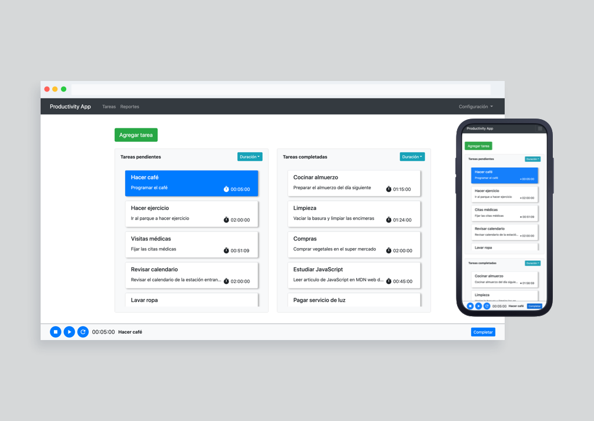

# Productivity App

Aplicación web desarrollada para medir la productividad de los usuarios mediante la administración de tareas.



## Introducción

El presente repositorio contiene una aplicación web que permite a los usuarios medir su productividad.

Sigue las siguientes instrucciones para obtener una copia del proyecto y ejecutarlo en tu ordenador para desarrollo y/o pruebas de evaluación.


### Prerequisitos

El entorno de desarrollo del proyecto está configurado para ser utilizado con *yarn*. Para poder configurar un entorno de desarrollo es necesario contar con:

```
* Node.js v12.13.0^
* yarn 1.19.1
```

## Instalación

Primero es necesario obtener una copia del proyecto. Si cuentas con alguna versión de *git* clona el repositorio con:

```
$ git clone origin https://github.com/0xELJ/productivity-app.git
```

Una vez obtenida la copia del proyecto se debe proceder a instalar las dependencias necesarias para ejecutar el entorno de desarrollo:

```
$ yarn install
```

Al finalizar la instalación, el entorno se encontrará listo para ser ejecutado.

### Ejecución

Es posible iniciar el entorno de desarrollo ejecutando el comando:

```
$ yarn start
```

Podrá acceder a la aplicación abriendo su navegador de preferencia e introduciendo http://localhost:3000.

## Tecnologías

* [Typescript](https://www.typescriptlang.org/)
* [React](https://reactjs.org/)
* [Redux](https://redux.js.org/)
* [Reselect](https://github.com/reduxjs/reselect)
* [React Bootstrap](https://react-bootstrap.github.io/)


## Autor

* **Enrique López Jiménez**
